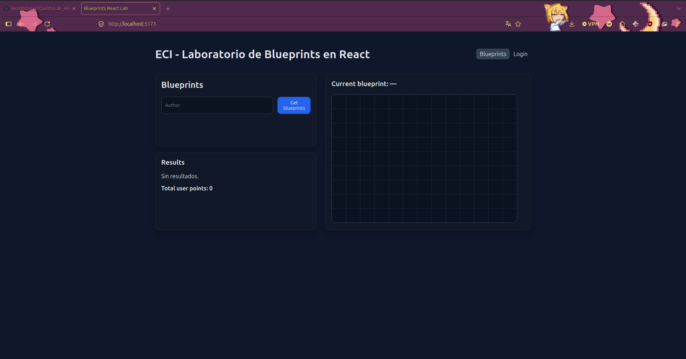
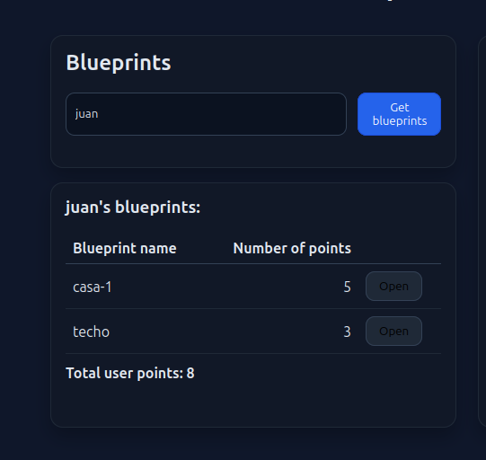
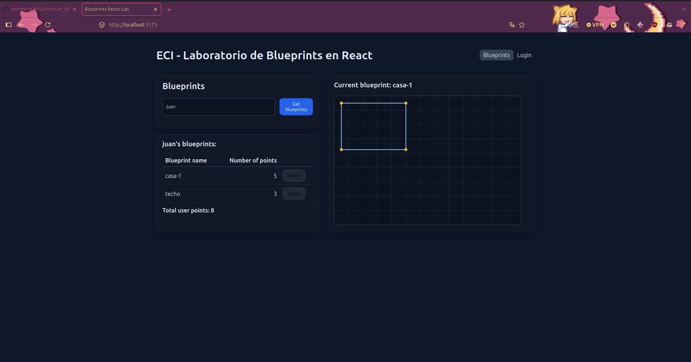
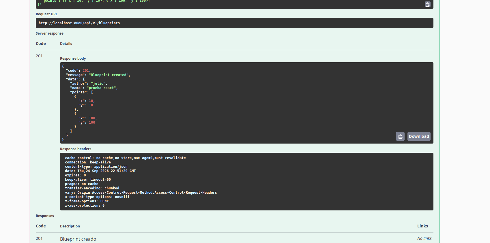
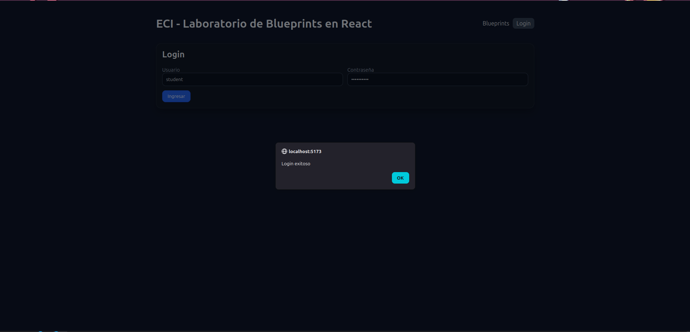
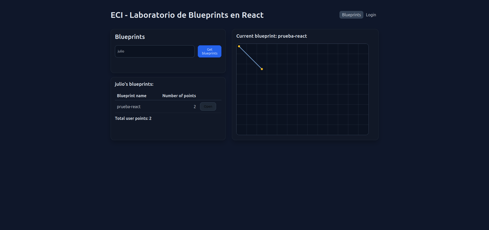

## Laboratorio 5
### Diego Patiño y Julio Mayorquin

### 1. Canvas

El componente `BlueprintCanvas` (`src/components/BlueprintCanvas.jsx`), con `id="blueprint-canvas"` propio y dimensiones por defecto `520×360`. Dibuja una grilla de fondo y, cuando recibe `points`, traza los segmentos consecutivos y marca cada punto con un círculo.



Conexion con el canva vacio. 


### 2. Listar los planos de un autor

En `BlueprintsPage.jsx`, el input de autor + botón **Get blueprints** despachan `fetchByAuthor`, que trae los planos y los muestra en una tabla con nombre, número de puntos y botón **Open**.



Listar autores mockeados

### 3. Seleccionar un plano y graficarlo

Al hacer clic en **Open**, se despacha `fetchBlueprint({author, name})`, que actualiza `current` en Redux. Eso hace que el título "Current blueprint: …" cambie y que `BlueprintCanvas` reciba los nuevos `points` y se redibuje.



Graficacion en canvas


### 4. Servicios `apimock` y `apiclient`

Se implementó la capa de servicios con interfaz común (`getAll`, `getByAuthor`, `getByAuthorAndName`, `create`):

- `src/services/apiclient.js` — consume el backend real vía Axios (usa `httpClient.js`, que trae los interceptores JWT).
- `src/services/apimock.js` — devuelve datos de prueba en memoria, simulando latencia de red.
- `src/services/blueprintsService.js` — decide cuál de los dos exportar según `VITE_USE_MOCK` en `.env`.

El resto de la app (`blueprintsSlice.js`) solo importa `blueprintsService`, sin saber si está hablando con el mock o con el backend real — el cambio es de una sola línea en `.env`.

Cabe aclarar que:
Al backend (Lab 4) le agregamos configuración de CORS en SecurityConfig.java — dos líneas nuevas (.cors(Customizer.withDefaults()) en la cadena de seguridad y un bean CorsConfigurationSource que autoriza explícitamente al origen http://localhost:5173). 



Creacion de blueprints julio.



Login backend exitoso.



Get de los blueprints, funcion open y graficacion correcta. 

### 5. Interfaz con React

- El plano actual vive en el estado global de Redux (`state.blueprints.current`). El título **"Current blueprint: …"** y el `BlueprintCanvas` lo leen con `useSelector`, así que se actualizan solos al despachar `fetchBlueprint` (ver captura del punto 3).
- No se manipula el DOM directamente: todo se hace con componentes, props y estado. La única referencia (`useRef`) es la del canvas, que se necesita para obtener su contexto 2D y dibujar.
- Ahora el estado de carga y de error es **independiente para cada thunk** (`status.authors`, `status.byAuthor`, `status.current`, `status.save` y lo mismo en `error`), así que cada sección de la UI muestra su propio "Cargando..." o su propio error.

### 6. Estilos

Los estilos están en `src/styles.css`, con un tema oscuro y sin frameworks externos:

- La tabla tiene la clase `.table`: columnas numéricas alineadas a la derecha, *hover* y la fila del plano abierto resaltada.
- Hay variantes de botones (`.btn`, `.btn.primary`, `.btn.danger`, estado `disabled`), tarjetas (`.card`), banners de error (`.banner.error`) y *badges*.
- El diseño es responsive (`.layout`): con menos de 860 px las dos columnas se apilan.


Vista general de la aplicación con los estilos aplicados.

### 7. Pruebas unitarias

Se usan Vitest, Testing Library y jsdom. Configuración:

- `vitest.config.js` activa `globals: true` (sin esto `@testing-library/jest-dom` falla con `expect is not defined`) y fuerza `VITE_USE_MOCK=true`, de modo que las pruebas nunca necesitan el backend.
- `tests/setup.js` siempre reemplaza `HTMLCanvasElement.prototype.getContext`, porque jsdom lo define pero devuelve `null`.
- `tests/utils.jsx` expone `renderWithStore`, que monta el componente con el store real y un `MemoryRouter`, y registra todas las acciones despachadas.

| Archivo | Qué valida |
| --- | --- |
| `BlueprintCanvas.test.jsx` | Render del canvas (id, 520×360, `getContext('2d')`), un segmento por cada par de puntos, un círculo por punto y la conversión de coordenadas al hacer click |
| `BlueprintForm.test.jsx` | Envío del formulario con puntos parseados, error si el JSON es inválido y puntos agregados haciendo click en el lienzo |
| `BlueprintsPage.test.jsx` | Dispatch de `fetchByAuthor`, tabla con resultados, **Open** que actualiza el plano actual y banner con **Reintentar** |
| `blueprintsSlice.test.jsx` | Reducers puros: pending/fulfilled/rejected, update y delete optimistas con *rollback* y el selector top-5 memoizado |
| `PrivateRoute.test.jsx` | Redirección a `/login` sin token y contenido visible con token |
| `services.test.js` | `apimock` y `apiclient` exponen la misma interfaz; CRUD en memoria del mock |

```bash
npm test   # 6 archivos, 20 pruebas
```


Resultado de `npm test`: las 20 pruebas pasan.

## Actividades sugeridas implementadas

### Redux avanzado

- Cada *thunk* tiene su propio estado `loading/error` y la UI lo muestra.
- `selectTopBlueprints` (`createSelector`) deriva el **top-5 de blueprints por número de puntos** a partir de todos los autores consultados. Es memoizado: si `byAuthor` no cambia, devuelve la misma referencia. Se muestra en la tarjeta "Top 5 por número de puntos".


### Rutas protegidas y autenticación

- El `authSlice` guarda el token, que también se persiste en `localStorage`, y tiene el thunk `login` y la acción `logout`.
- `<PrivateRoute>` redirige a `/login` si no hay token y, después de iniciar sesión, devuelve al usuario a la ruta que intentaba abrir.
- La creación (`/blueprints/new`) está protegida. Editar y eliminar solo aparecen con sesión iniciada.
- El interceptor de Axios agrega `Authorization: Bearer <token>`. Si el backend responde **401**, borra el token y despacha `logout` para que Redux quede sincronizado.
- En modo mock, cualquier usuario y contraseña no vacíos obtienen un token de prueba.


Al entrar a **Nuevo** sin sesión, la app redirige al login.

### CRUD completo con *optimistic updates*

- Los servicios agregan `update(author, name, bp)` y `remove(author, name)`, que llaman a `PUT` y `DELETE /api/v1/blueprints/{author}/{name}` en el API real.
- En el slice, `updateBlueprint` y `deleteBlueprint` aplican el cambio en `pending` y guardan una copia del estado anterior en `rollback[requestId]`. Si la petición falla (`rejected`), restauran esa copia y muestran el error "No se pudo guardar… Cambios revertidos".

### Dibujo interactivo

- `BlueprintCanvas` recibe `onAddPoint`. Al hacer click convierte la posición del mouse a coordenadas internas del canvas, teniendo en cuenta que el canvas se escala por CSS.
- **Crear:** en `/blueprints/new`, cada click agrega un punto (que también aparece en el JSON editable), y **Guardar** envía el blueprint con `createBlueprint`.
- **Editar:** sobre el plano abierto, cada click agrega puntos a un borrador. **Guardar cambios** hace el `PUT`, **Descartar** deshace el borrador y **Eliminar** hace el `DELETE`, previa confirmación.
- La página de detalle (`/blueprints/:author/:name`) ahora usa el canvas en lugar del `svg`.


Creación de un blueprint haciendo click en el lienzo.


Edición de un blueprint existente: puntos agregados y botones Guardar, Descartar y Eliminar.

### Errores y *Retry*

Cuando un `GET` falla, `ErrorBanner` muestra el mensaje y un botón **Reintentar** que vuelve a despachar el thunk (`fetchByAuthor` o `fetchAuthors`).


Consulta de un autor inexistente: aparece el banner con Reintentar.

### CI / Lint / Format

- `.github/workflows/ci.yml` ejecuta lint, test y build en cada push y en cada pull request. Se quitó `cache: 'npm'` porque requiere un `package-lock.json`, que no se versiona.
- `npm run lint` (ESLint 9, *flat config*) y `npm run format` (Prettier) pasan sin errores.

### Docker

Vite incrusta las variables `VITE_*` **al compilar**, no al ejecutar. Por eso el `Dockerfile` las recibe como `ARG`, y `docker-compose.yml` las pasa en `build.args`:

```bash
docker compose up --build   # front en http://localhost:5173
```

## Cómo ejecutar

```bash
npm install
cp .env.example .env
npm run dev
```

| Variable | Valor | Efecto |
| --- | --- | --- |
| `VITE_USE_MOCK` | `true` | Usa `apimock` (datos en memoria, no necesita backend) |
| `VITE_USE_MOCK` | `false` | Usa `apiclient` (backend real del Lab 4) |
| `VITE_API_BASE_URL` | `http://localhost:8080/api` | URL base del backend |

Autores disponibles en el mock: `juan` (casa-1, techo) y `maria` (garage).
