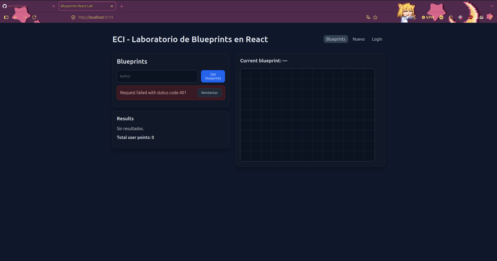
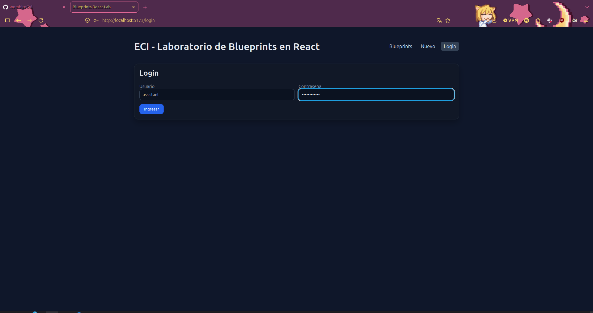
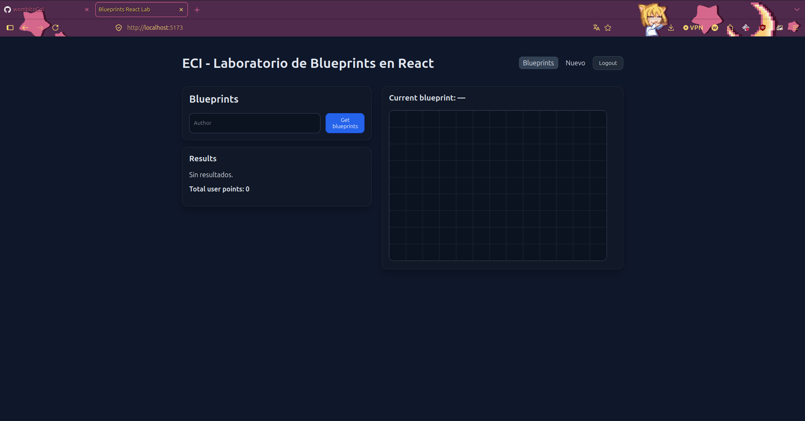
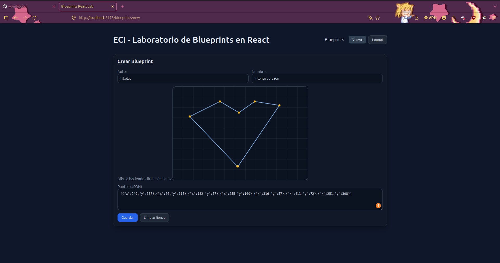
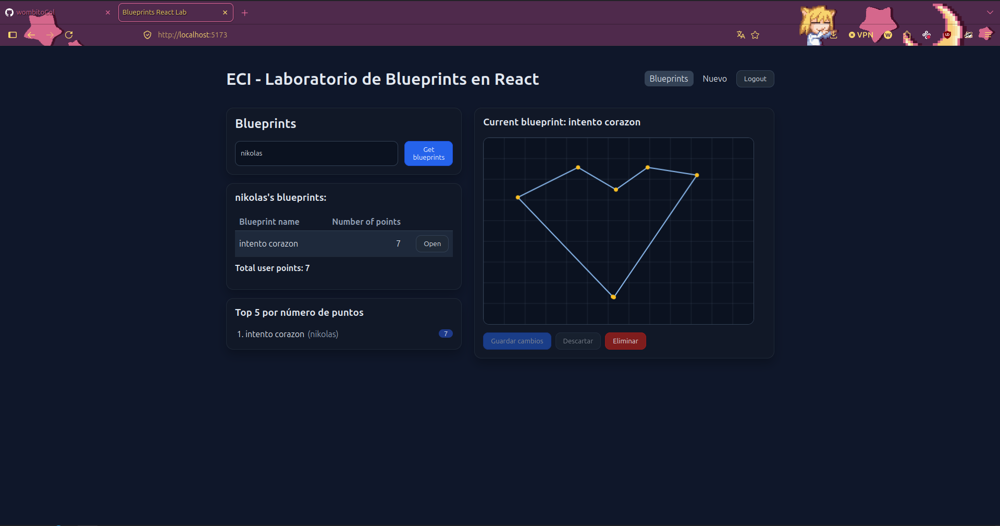
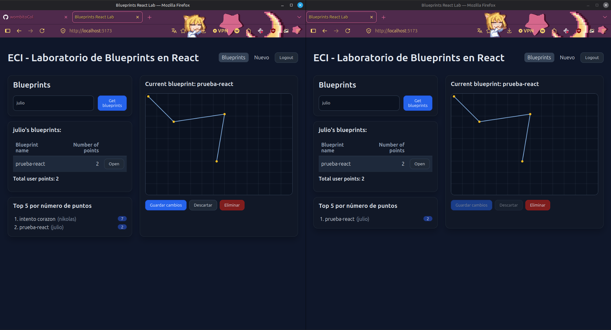

## Estructura del proyecto

Entrega-Final/
- backend-crud/ # Laboratory4 — Spring Boot, CRUD + JWT + Postgres (puerto 8080)
- backend-stomp/ # Backend STOMP — Spring Boot, solo broker WebSocket (puerto 8081)
- lab5_ARSW/ # React + Vite — Login, CRUD, canvas y tiempo real (puerto 5173)


## Cómo ejecutar todo

### 1. Base de datos (Postgres)

```bash
docker compose up -d
```

### 2. Backend CRUD (puerto 8080)

```bash
cd backend-crud
mvn spring-boot:run
```

### 3. Backend STOMP (puerto 8081)

```bash
cd backend-stomp
mvn spring-boot:run
```

### 4. Frontend (puerto 5173)

```bash
cd frontend
cp .env.example .env.local
npm install
npm run dev
```

Abre `http://localhost:5173` en el navegador.

### Usuarios de prueba

| Usuario | Contraseña | Permisos |
|---|---|---|
| `student` | `student123` | solo lectura |
| `assistant` | `assistant123` | lectura y escritura |

## Evidencia

### Login





### Creación de un blueprint



### Revisión de blueprints (listado y detalle)



## Tiempo real

La colaboración en vivo se implementó con **STOMP sobre WebSocket**: al dibujar un punto en el canvas, el cliente lo publica al backend (`/app/draw`), que lo retransmite por el tópico `/topic/blueprints.{author}.{name}` a todos los clientes suscritos al mismo plano. Así, cualquier usuario que tenga abierto ese mismo blueprint ve los puntos aparecer en su pantalla sin recargar, mientras que el guardado real en la base de datos sigue ocurriendo por el flujo REST normal (`PUT`).

### Demostración (2 pestañas)



video in real time
https://drive.google.com/file/d/1VNxn7kbm5463MTy368vA2-gE9-iua18Z/view?usp=sharing

